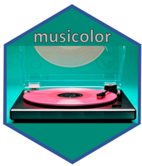
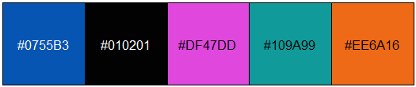
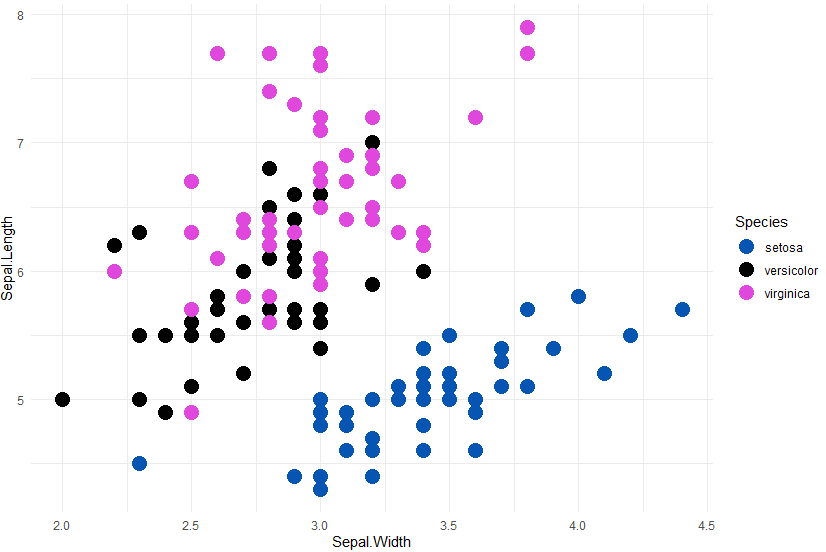
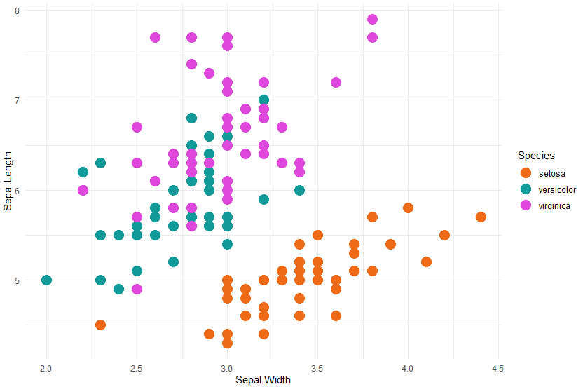

# musicolor 


## Overview
Color scales generated from music album covers ready to be used in ggplot visualizations


## Installation

``` r
# You can download the development version of the package from github:
devtools::install_github('bougioukas/musicolor')
```


## Color palettes

**Colors from Dire Straits album covers**

The list of available palettes includes: "on_the_night", "so_far_away", "brothers_in_arms", "communique", "money_for_nothing" (default), "dire_straits", "on_every_street", "alchemy", "studio_99", "making_movies", "love_over_gold", "roterdam", and "very_best".


``` r
library(musicolor)

# Hex code colors from the "Money for Nothing" album cover
direstraits_palette("money_for_nothing")
```

[1] "#0755B3"   "#010201"   "#DF47DD"   "#109A99"   "#EE6A16"


We can also see the colors using the show_colors() function:

``` r
# see the colors for the "Money for Nothing" album cover
show_colors("money_for_nothing")
```



## Example

**scale_color_direstraits()**

``` r
library(musicolor)

ggplot2::ggplot(iris, ggplot2::aes(x = Sepal.Width, y = Sepal.Length, color = Species)) +
  ggplot2::geom_point(size = 5.0) +
  scale_color_direstraits("money_for_nothing") +
  ggplot2::theme_minimal()
```




``` r
ggplot2::ggplot(iris, ggplot2::aes(x = Sepal.Width, y = Sepal.Length, color = Species)) +
  ggplot2::geom_point(size = 5.0) +
  scale_color_direstraits("money_for_nothing", direction = -1) +
  ggplot2::theme_minimal()
```



